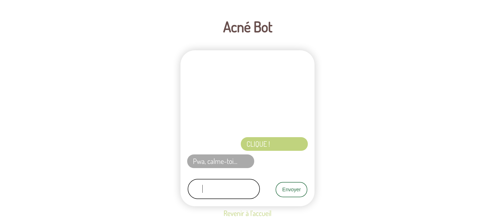

# JiEss

## Aperçu

Petits script JS codés lors du jour 38 de THP

## Live Site

[Demo Link](https://priceless-leakey-de0c2e.netlify.app/)

## ToDo

- [x] Script 1
- [x] Script 2
- [x] Script 3
- [x] Script 4
- [x] Script 5
- [x] Script 6
- [x] Script 7
 
## Crédits et remerciements

Merci à [The Hacking Project](https://www.thehackingproject.org/) et à tous les moussaillons pour cette formation de qualité !
